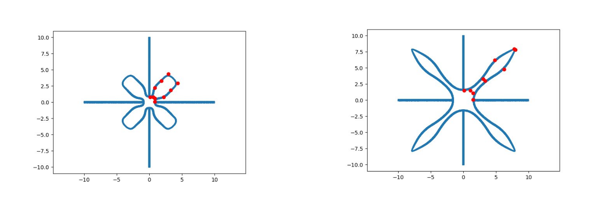
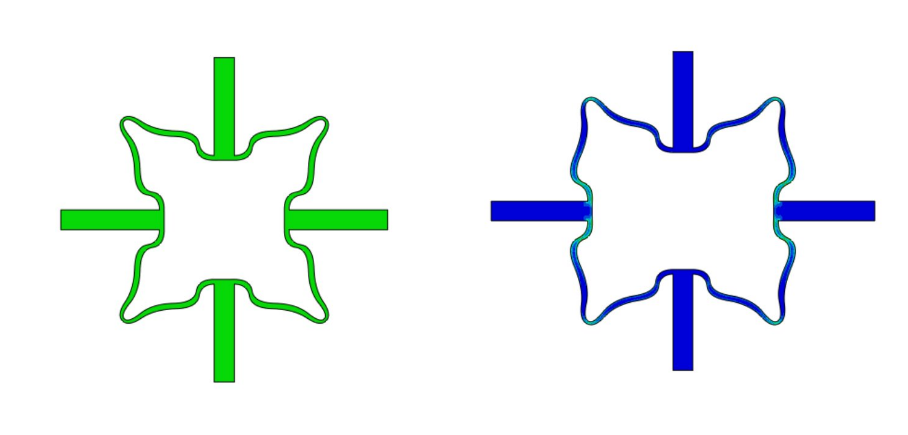
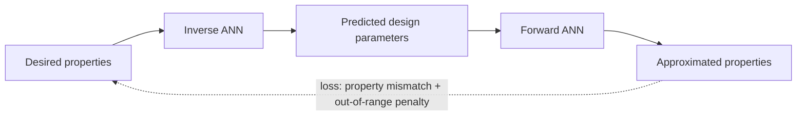

# Inverse Design of Tetra-Petal Auxetic Metamaterials with Machine Learning
*Khanh Bui, Khang Vo, Tomáš Remiš, Hung Le - Aalto University*

This project uses machine learning to **design metamaterials from their desired properties**. Given a target effective Poisson's ratio, Young's modulus and volume fraction, an inverse neural network predicts the geometric design parameters of a tetra-petal unit cell that should achieve those properties.

The geometry follows the NURBS-based tetra-petal parameterization of Wang et al., and the ML pipeline (a forward surrogate model used inside the training loop of an inverse model) follows the approach of Ha et al.


---

## Table of contents

- [Background](#background)
- [Method](#method)
- [Results](#results)
- [Repository structure](#repository-structure)
- [Installation](#installation)
- [Usage](#usage)
  - [1. Run the GUI (no Abaqus needed)](#1-run-the-gui-no-abaqus-needed)
  - [2. Generate designs and meshes](#2-generate-designs-and-meshes)
  - [3. Simulate in Abaqus](#3-simulate-in-abaqus)
  - [4. Train the models](#4-train-the-models)
- [Limitations and future work](#limitations-and-future-work)
- [Key references](#key-references)

---

## Background

Metamaterials derive their properties from their **structure** rather than their composition. Tetra-petal structures are isotropic and often **auxetic** (negative Poisson's ratio), which makes them a good test case for inverse design: instead of simulating a geometry to find its properties, we want to go from desired properties straight to a geometry.

## Method

### Geometry parameterization

A "parent petal" is built from 10 NURBS control points. The first 5 are placed according to the design parameters and the last 5 are obtained by mirroring along the y axis. The parent petal is then rotated four times and joined with connecting bars to form the unit cell.

Each design is defined by **8 parameters**:

| Parameter | Description |
|-----------|-------------|
| `w_1` | Position of the first control point (petal base), which lies on the 45° diagonal at `(w_1, w_1)` |
| `d_1` | Distance from the first to the second control point, perpendicular to the diagonal |
| `w_2`, `w_3`, `w_4` | Horizontal positions of the third, fourth and fifth control points, at one-third, two-thirds and full height |
| `h_4` | Height of the top (fifth) control point |
| `d_2` | Wall thickness of the petal |
| `d_3` | Width of the connecting bars |


### Dataset

- **1000 designs**, sampled with **Latin Hypercube Sampling** from a predefined range for each parameter.
- Each design is meshed and simulated in **Abaqus** (uniaxial tension along x) and its effective properties are obtained through computational homogenization.
- Base material: Young's modulus `3e9`, Poisson's ratio `0.35`.

Example row:

| w_1 | w_2 | w_3 | w_4 | h_4 | d_1 | d_2 | d_3 | Poisson | Young | Volume |
|-----|-----|-----|-----|-----|-----|-----|-----|---------|-------|--------|
| 1.4 | 0.6 | 1.4 | 0.5 | 11  | 1   | 0.2 | 0.2 | -1.047  | 0.009 | 0.052  |

### ML pipeline



1. Train the **forward model** (design parameters → properties).
2. Freeze it and use it as a differentiable property approximator inside the loss of the **inverse model** (properties → design parameters).
3. Validate the inverse model's designs with new Abaqus simulations.

**Forward model**

- Architecture: `8 → 128 → 64 → 32 → 3`, fully connected layers with BatchNorm, ReLU and Dropout
- Standard scaling for inputs and targets (fit on the training set only)
- MSE loss

**Inverse model**

- Architecture: `3 → 256 → 512 → 512 → 256 → 8`, BatchNorm + ReLU after each hidden layer
- Standard scaling for inputs (properties), min-max scaling for targets (design parameters), both fit on the training set only
- AdamW (decoupled weight decay) instead of Dropout
- L1 (MAE) loss between the requested properties and the forward-predicted properties, plus a penalty for design parameters that leave their allowed range. L1 is used because many designs can satisfy the same set of properties.

## Results

**Forward model (test set)**

| Property | MSE | MAE | $R^2$ |
|----------|-----|-----|-------|
| Effective Poisson's ratio | 0.001 | 0.026 | 0.991 |
| Effective Young's modulus | 0.001 | 0.033 | 0.992 |
| Volume fraction | 0.000 | 0.003 | 0.991 |

**Inverse model (test set, desired vs forward-predicted properties)**

| Property | MSE | MAE | $R^2$ |
|----------|-----|-----|-------|
| Effective Poisson's ratio | 0.011 | 0.067 | 0.908 |
| Effective Young's modulus | 0.041 | 0.124 | 0.836 |
| Volume fraction | 0.000 | 0.010 | 0.919 |

**Validation with Abaqus (new designs, desired vs FEA-simulated properties)**

| Property | MSE | MAE | $R^2$ |
|----------|-----|-----|-------|
| Effective Poisson's ratio | 0.012 | 0.070 | 0.921 |
| Effective Young's modulus | 0.040 | 0.111 | 0.874 |
| Volume fraction | 0.000 | 0.008 | 0.958 |

The forward and inverse models agree closely, but the simulated properties deviate more from the targets, most visibly for Young's modulus. Because the inverse model is trained through the forward surrogate, any approximation error in the forward model carries over to the generated designs.

## Repository structure

```
.
├── inputs/            # Example CSV of target properties for the GUI
├── ml_workflow/       # Model definitions, trainers, training notebooks and the dataset (simulation_results.csv)
├── models_pth/        # Trained model checkpoints loaded by the GUI (.pth)
├── outputs/           # Predicted designs saved from the GUI (CSV and .inp files)
├── pipeline/          # LHS sampling, mesh generation, Abaqus simulation and evaluation scripts, simulation data
├── plots/             # Training curves, parity plots, error distributions, example designs
├── ui/                # GUI widgets (PySide6)
├── data_scaler.py     # Re-exports DataScaler at the root; required for the GUI to load the saved models
├── main.py            # Launches the GUI
├── instructions.txt   # Original manual Abaqus notes (superseded by the pipeline scripts)
├── requirements.txt
└── README.md

```

## Installation

```bash
git clone https://github.com/khanhv0/metamaterials-inverse-design.git
cd metamaterials-inverse-design
pip install -r requirements.txt
```

Generating new training data also requires **Abaqus**. Training the models and using the GUI do not.

## Usage

All commands are run from the repository root unless stated otherwise.

### 1. Run the GUI (no Abaqus needed)

```bash
python main.py
```

The GUI loads the pretrained models from `models_pth/`. Everything is under the **File** menu:

- **Predict from CSV** - pick a CSV of target properties (opens in `inputs/`). An example is `inputs/properties_test_samples.csv`.
- **Save results** - save the predictions as a CSV (defaults to `outputs/`).
- **Save predicted designs** - mesh every design in the list and write Abaqus input files to `outputs/batch_results/jobdesign_XXXX/jobdesign_XXXX.inp`.
- **Load results** - reopen a previously saved results CSV.

The input CSV needs one row per target and the columns `poisson`, `young` and `volume_frac`:

```csv
poisson,young,volume_frac
-0.187,0.066,0.072
```

The designs appear in the list on the right. Left-click a design to draw its unit cell and show its requested and forward-predicted properties. Designs highlighted in orange have at least one parameter outside the sampled range. Right-click a design to remove it from the list.

The results CSV contains `w1, w2, w3, w4, h4, d1, d2, d3`, the `*_requested` and `*_predicted` properties, and a `possibly_problematic` flag.

### 2. Generate designs and meshes

Open `pipeline/mesh_generation_test.ipynb` with `pipeline/` as the working directory. The first cells:

1. sample design parameters with Latin Hypercube Sampling (`LHSSampler`) and save them to `test_samples.csv`,
2. mesh each design with `MeshGenerator.generateMeshesBatch`, writing `batch_results/jobdesign_XXXX/jobdesign_XXXX.inp`.

The parameter ranges, number of samples and seed are set in the notebook. Each `.inp` file already contains the material, section, load step, boundary conditions (uniaxial tension along x) and output requests, so no manual setup in Abaqus/CAE is needed.

### 3. Simulate in Abaqus

Requires Abaqus. From `pipeline/`:

```bash
abaqus python evaluate_simulations.py
```

For every folder in `batch_results/` this runs the Abaqus job (skipped if `Job.odb` already exists), computes the effective Poisson's ratio, Young's modulus and volume fraction from the `.odb`, and writes them next to the design parameters in `simulation_results.csv`.

### 4. Train the models

Training is done from the notebooks in `ml_workflow/`, with `ml_workflow/` as the working directory and the dataset in `ml_workflow/simulation_results.csv`:

1. `forward_training_notebook.ipynb` - trains the forward model and saves `forward_model_with_scaler.pth`.
2. `inverse_training_notebook.ipynb` - trains the inverse model using the saved forward model and saves `inverse_model_with_scaler.pth`.

Checkpoints and plots are saved to `ml_workflow/`. To use newly trained models in the GUI, copy both `.pth` files to `models_pth/`.


## Limitations and future work

- The forward model fits the dataset well but does not perfectly reproduce the Abaqus simulations, which limits the accuracy of the inverse designs.
- The error distributions show occasional outliers for Poisson's ratio and Young's modulus.

Possible next steps:

- A more expressive forward model that better captures the simulation behaviour
- A larger dataset to support that model
- Better regularization to reduce outliers
- Retraining the inverse model on top of an improved forward model

## Key References

- Z.-P. Wang, L. H. Poh, Y. Zhu, J. Dirrenberger, and S. Forest, "Systematic design of tetra-petals auxetic structures with stiffness constraint," *Mater. Des.*, vol. 170, p. 107669, 2019. doi:10.1016/j.matdes.2019.107669
- Z.-P. Wang and L. H. Poh, "Optimal form and size characterization of planar isotropic petal-shaped auxetics with tunable effective properties using IGA," *Compos. Struct.*, vol. 201, pp. 486-502, 2018. doi:10.1016/j.compstruct.2018.06.042
- A. Challapalli, D. Patel, and G. Li, "Inverse machine learning framework for optimizing lightweight metamaterials," *Mater. Des.*, vol. 208, p. 109937, 2021. doi:10.1016/j.matdes.2021.109937
- C. Zhang and Y. F. Zhao, "A critical review on the application of machine learning in supporting auxetic metamaterial design," *J. Phys. Mater.*, vol. 7, no. 2, p. 022004, 2024. doi:10.1088/2515-7639/ad33a4
- C. S. Ha et al., “Rapid inverse design of metamaterials based on prescribed 
mechanical behavior through machine learning,” Nat. Commun., vol. 14, no. 1, p. 
5765, Sept. 2023, doi: 10.1038/s41467-023-40854-1. 

